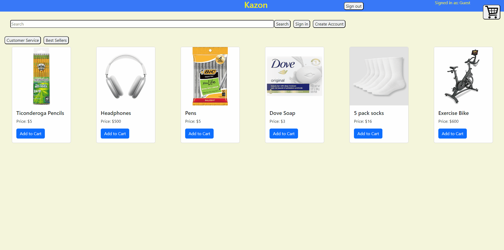
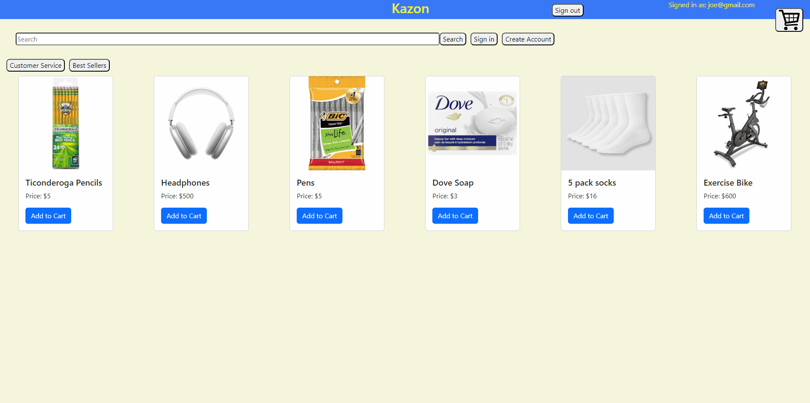
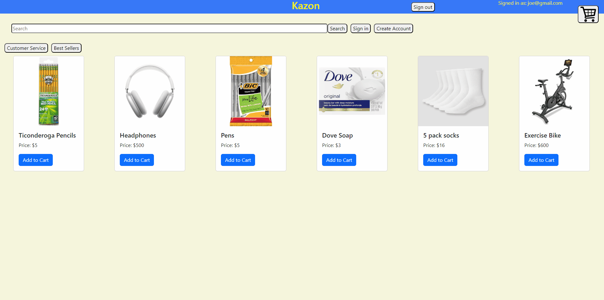

# Kazon 
## This is an e-commerce site built with the PERN stack. 
### It lets users create an account, add and remove items from their cart, make reports, and, search for products. 

## Deployed on Amazon EC2 Servers
https://tinyurl.com/2p82bsya

## To Run
### Run the backend first
https://github.com/ShashiSugrim/kazonbackend

### Run the front end 
#### (must have the backend running for the website to function)
```
npm install
npm start
```

## Create account and cart functionality


## Continuing cart functionality, search, and sign in


## Make a report

